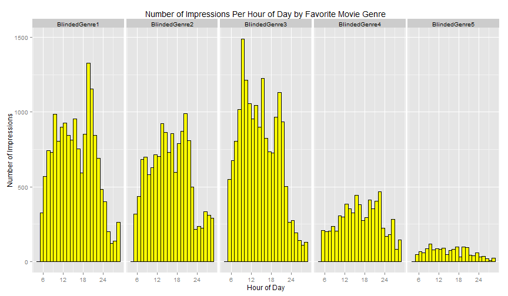
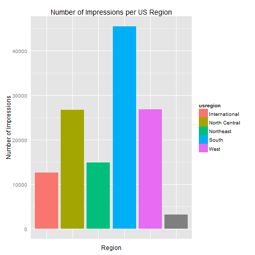
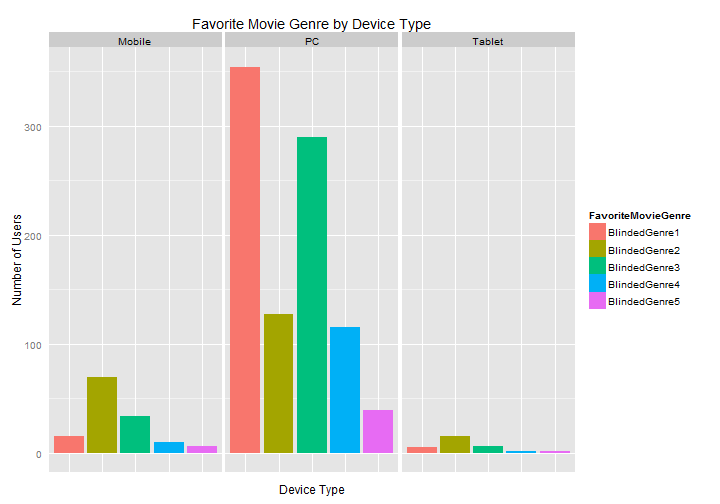
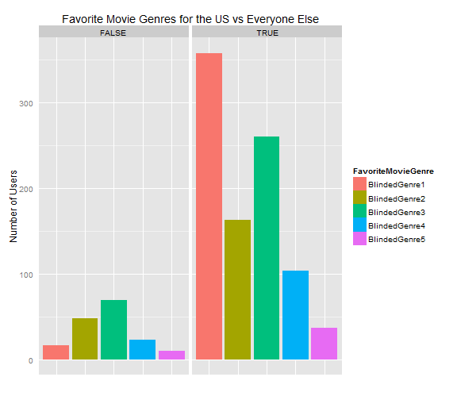
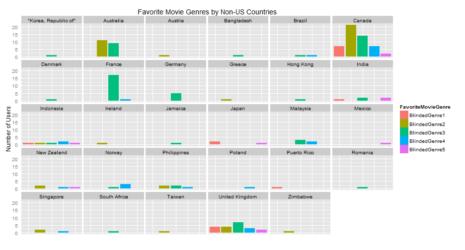
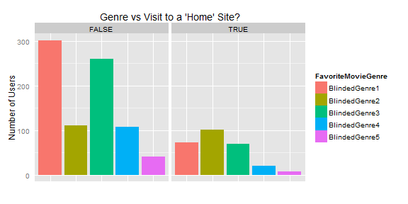
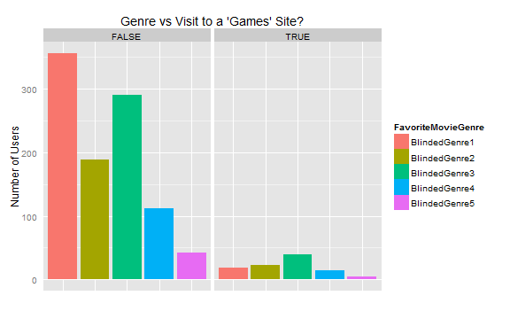
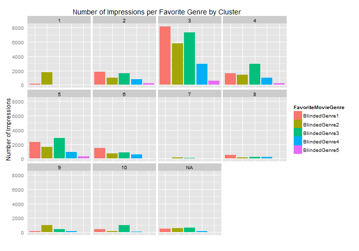
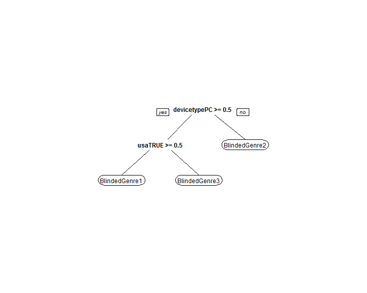

## Getting and Cleaning Data


- Read in the data file and examine its contents


```r
impData <- read.table("ImpData.txt", header=T, sep='\t', 
        na.strings='(null)', quote="")
nrow(impData)
```

```
## [1] 129577
```

```r
colnames(impData)
```

```
##  [1] "tdid"               "logentrytime"       "logfileid"         
##  [4] "site"               "userHourOfWeek"     "country"           
##  [7] "region"             "metro"              "city"              
## [10] "devicetype"         "osfamily"           "os"                
## [13] "browser"            "FavoriteMovieGenre"
```


---

## Format/Consolidate URL's


```r
length(levels(impData$site))
```

```
## [1] 8414
```

- Remove the leading "www" and mark "site-not-provided" sites as NA.


```r
impData$site <- as.character(impData$site)
impData$site <- sub("^www\\.(.*)", "\\1", impData$site)
impData$site[grepl(".*\\.site-not-provided", impData$site)] <- NA
impData$site <- factor(impData$site)
length(levels(impData$site))
```

```
## [1] 7444
```


- Removed about 1,000 unique URL's. 

---

## Site Classification

- Used natural language processing tool from uclassify.com to categorize all of the URL's in the dataset.
- Excerpt of Python code used below (entire file can be found on Github):

```{python}
def getSiteClassificationData(apiKey, classifierName, url):
    requestURL = "http://uclassify.com/browse/uClassify/Topics/ClassifyUrl?readkey=" + \
        apiKey + "&url=" + url + "&version=1.01"
    try:
        myFile = urllib2.urlopen(requestURL)
        data = myFile.read()
        myFile.close()
        dataDict = xmltodict.parse(data)
        return dataDict
    except urllib2.HTTPError:
        print "Error for url " + url
        return {}
```

---

## Site Classification

uclassify.com's API returns a probability for each of ten categories based on the text on the page provided:


```r
siteData <- read.csv('categories.csv', stringsAsFactors=F)
colnames(siteData)
```

```
##  [1] "URL"        "Arts"       "Business"   "Science"    "Computers" 
##  [6] "Recreation" "Sports"     "Society"    "Health"     "Home"      
## [11] "Games"
```

```r
knitr::kable(siteData[1:4,1:5])
```


|URL                      |     Arts|  Business|   Science| Computers|
|:------------------------|--------:|---------:|---------:|---------:|
|us.msn.com               | 0.340712| 0.0257158| 0.0134926|  0.009882|
|answers.com              | 0.101944| 0.0811187| 0.0308013|  0.317147|
|yahoonetplus.com         |       NA|        NA|        NA|        NA|
|everquest.allakhazam.com | 0.103094| 0.0295731| 0.0160058|  0.306243|

---

## Site Classification

Determine the category of each URL, but only if uclassify is confident above some threshold that the site falls into that category.


```r
# Merge the two data sets using the site/URL as the key
impData <- merge(x = impData, y = siteData, by.x = 'site', by.y = 'URL', all.x = T)

impData$sitecategory <- "Unclassified"
maxSiteScores <- apply(impData[14:23],1,max)

# Determine the category, only if the confidence is above 90%
threshold <- 0.9
impData$sitecategory[!is.na(maxSiteScores) & maxSiteScores > threshold] <- 
    colnames(impData[14:23])[
        apply(impData[!is.na(maxSiteScores) & maxSiteScores > threshold, 
            c(14:23)], 1, which.max)]
```


---

## Transforming Timestamp Data


```r
bHourNA <- is.na(impData$userHourOfWeek)

# Get the hour of the day (0-23) by taking mod 24
impData$userHourOfDay <- impData$userHourOfWeek %% 24

# The hours of 12AM to 4AM are really "late night" the previous day
weeHours <- impData$userHourOfDay < 5 & !bHourNA
normHours <- impData$userHourOfDay >= 5 & !bHourNA

# Shift the hours of the day and day of the week to account for this
impData$userHourOfDay[weeHours] <- impData$userHourOfDay[weeHours] + 19
impData$userHourOfDay[normHours] <- impData$userHourOfDay[normHours] - 5

impData$userDayOfWeek <- impData$userHourOfWeek %/% 24
impData$userDayOfWeek[weeHours] <- impData$userDayOfWeek[weeHours] - 1
impData$userDayOfWeek[impData$userDayOfWeek == -1] <- 6
```

---

## Transforming Timestamp Data



---

## Transforming Timestamp Data


```r
impData$userPeriodOfWeek <- factor(impData$userPeriodOfWeek, labels = c("SundayMorn",
                                 "SundayAft", "SundayEve", "SundayLate", "WeekdayMorn",
                                 "WeekdayAft", "WeekdayEve", "WeekdayLate",
                                 "SaturdayMorn", "SaturdayAft", "SaturdayEve", 
                                 "SaturdayLate"))
impData$userDayOfWeek <- factor(impData$userDayOfWeek, labels = c("Sunday", 
                                 "Monday", "Tuesday", "Wednesday", "Thursday", 
                                 "Friday", "Saturday"))
```

---

## United States Regions


- Use state data to map the impression to one of the four US Regions


```r
impData$usa <- as.character(impData$country) == "United States"

data(state)
impData$usregion <- sapply(as.character(impData$region), function(x) 
    as.character(state.region[pmatch(x, state.name)]))

impData$usregion[impData$region == "District of Columbia"] <- "Northeast"
impData$usregion[!is.na(impData$usa) & !impData$usa] <- "International"
impData$usregion <- factor(impData$usregion)
```

---

## United States Regions



---

## Summarizing the Impressions Per User

- Accomplished using the plyr package in R
- Most features are constant per user across impressions (country, os, etc.)
- Time and website url are the two features that vary greatly across impressions


```r
# we'll use this function to summarize data by user
Mode <<- function(x) {
    xtable <- table(x)
    if (sum(xtable))
        return(names(which.max(table(x))))
    else 
        return(NA)
}

userData <- ddply(impData, .(tdid), summarize,
    country = Mode(country),
    region = Mode(region),
    metro = Mode(metro),
    city = Mode(city),
    devicetype = Mode(devicetype),
    osfamily = Mode(osfamily),
    os = Mode(os),
    browser = Mode(browser),
    FavoriteMovieGenre = Mode(FavoriteMovieGenre),
    usregion = Mode(usregion),
    usa = sum(usa, na.rm=T) / sum(!is.na(usa)) > 0.5,
    SundayMorn = sum(userPeriodOfWeek == "SundayMorn", na.rm=T)/sum(!is.na(userPeriodOfWeek)),
    SundayAft = sum(userPeriodOfWeek == "SundayAft", na.rm=T)/sum(!is.na(userPeriodOfWeek)),
    SundayEve = sum(userPeriodOfWeek == "SundayEve", na.rm=T)/sum(!is.na(userPeriodOfWeek)),
    SundayLate = sum(userPeriodOfWeek == "SundayLate", na.rm=T)/sum(!is.na(userPeriodOfWeek)),
    WeekdayMorn = sum(userPeriodOfWeek == "WeekdayMorn", na.rm=T)/sum(!is.na(userPeriodOfWeek))/5,
    WeekdayAft = sum(userPeriodOfWeek == "WeekdayAft", na.rm=T)/sum(!is.na(userPeriodOfWeek))/5,
    WeekdayEve = sum(userPeriodOfWeek == "WeekdayEve", na.rm=T)/sum(!is.na(userPeriodOfWeek))/5,
    WeekdayLate = sum(userPeriodOfWeek == "WeekdayLate", na.rm=T)/sum(!is.na(userPeriodOfWeek))/5,
    SaturdayMorn = sum(userPeriodOfWeek == "SaturdayMorn", na.rm=T)/sum(!is.na(userPeriodOfWeek)),
    SaturdayAft = sum(userPeriodOfWeek == "SaturdayAft", na.rm=T)/sum(!is.na(userPeriodOfWeek)),
    SaturdayEve = sum(userPeriodOfWeek == "SaturdayEve", na.rm=T)/sum(!is.na(userPeriodOfWeek)),
    SaturdayLate = sum(userPeriodOfWeek == "SaturdayLate", na.rm=T)/sum(!is.na(userPeriodOfWeek)),
    bArts = "Arts" %in% sitecategory,
    bBusiness = "Business" %in% sitecategory,
    bScience = "Science" %in% sitecategory,
    bComputers = "Computers" %in% sitecategory,
    bRecreation = "Recreation" %in% sitecategory,
    bSports = "Sports" %in% sitecategory,
    bSociety = "Society" %in% sitecategory,
    bHealth = "Health" %in% sitecategory,
    bHome = "Home" %in% sitecategory,
    bGames = "Games" %in% sitecategory
)
rownames(userData) <- userData$tdid
userData[2:11] <- as.data.frame(lapply(userData[2:11], factor))

userData$usregion[userData$usa == "TRUE" & is.na(userData$usregion)] <- "South"

# impute the medians for the periodOfWeek vars
userData <- transform(userData, 
    SundayMorn = ifelse(is.na(SundayMorn), median(SundayMorn, na.rm=TRUE), SundayMorn),
    SundayAft = ifelse(is.na(SundayAft), median(SundayAft, na.rm=TRUE), SundayAft),
    SundayEve = ifelse(is.na(SundayEve), median(SundayEve, na.rm=TRUE), SundayEve),
    SundayLate = ifelse(is.na(SundayLate), median(SundayLate, na.rm=TRUE), SundayLate),
    WeekdayMorn = ifelse(is.na(WeekdayMorn), median(WeekdayMorn, na.rm=TRUE), WeekdayMorn),
    WeekdayAft = ifelse(is.na(WeekdayAft), median(WeekdayAft, na.rm=TRUE), WeekdayAft),
    WeekdayEve = ifelse(is.na(WeekdayEve), median(WeekdayEve, na.rm=TRUE), WeekdayEve),
    WeekdayLate = ifelse(is.na(WeekdayLate), median(WeekdayLate, na.rm=TRUE), WeekdayLate),
    SaturdayMorn = ifelse(is.na(SaturdayMorn), median(SaturdayMorn, na.rm=TRUE), SaturdayMorn),
    SaturdayAft = ifelse(is.na(SaturdayAft), median(SaturdayAft, na.rm=TRUE), SaturdayAft),
    SaturdayEve = ifelse(is.na(SaturdayEve), median(SaturdayEve, na.rm=TRUE), SaturdayEve),
    SaturdayLate = ifelse(is.na(SaturdayLate), median(SaturdayLate, na.rm=TRUE), SaturdayLate)
)
```

---

## Summarize Sites by Favorite Movie Genre


```r
userSiteCounts <- ddply(impData[impData$FavoriteMovieGenre != "?????",],
    .(tdid, site), summarize, count = length(FavoriteMovieGenre),
    FavoriteMovieGenre = FavoriteMovieGenre[1])

siteGenreCounts <- ddply(userSiteCounts, .(site, FavoriteMovieGenre),
    summarize, count = length(count))
```

---

## Split Data by Whether Genre is Known/Unknown


```r
userData$FavoriteMovieGenre <- as.character(userData$FavoriteMovieGenre)
userData$tdid <- as.character(userData$tdid)

userKnown <- subset(userData, FavoriteMovieGenre != "?????")
userKnown$FavoriteMovieGenre <- factor(userKnown$FavoriteMovieGenre)
userKnown$tdid <- factor(userKnown$tdid)

userUnknown <- subset(userData, FavoriteMovieGenre == "?????")
userUnknown$FavoriteMovieGenre <- NULL
userUnknown$tdid <- factor(userUnknown$tdid)

userData$tdid <- factor(userData$tdid)
userData$FavoriteMovieGenre <- factor(userData$FavoriteMovieGenre)
```

---

## Exploratory Analysis



---

## Exploratory Analysis



---

## Exploratory Analysis



---

## Blinded Genre Guesses

1. Action/Adventure
2. Animated Movies
3. Comedy
4. Drama
5. Documentaries

---

## BlindedGenre1: Action/Adventure
- Most popular favorite genre in the United States
- Not nearly as popular in other countries
- If a user has visited a 'Home' site, much less likely to like BlindedGenre1:



---

## BlindedGenre2: Animated Movies
- Thesis: BlindedGenre2 is likely Animated Movies because it includes both children and parents.
- Children
  * Spike at 3pm - children arriving home from school
  * Much higher likelihood that a genre 2 user was using a mobile or tablet device
- Parents:
  

```r
bg2 <- siteGenreCounts[!is.na(siteGenreCounts$site) & siteGenreCounts$FavoriteMovieGenre == "BlindedGenre2",]
head(as.character(bg2[order(bg2$count, decreasing=T),"site"]), n = 20)
```

```
##  [1] "answers.com"        "yahoonetplus.com"   "us.msn.com"        
##  [4] "simplyrecipes.com"  "youtube.com"        "news.yahoo.com"    
##  [7] "huffingtonpost.com" "walmart.com"        "ebay.com"          
## [10] "cafemom.com"        "cnn.com"            "dailymail.co.uk"   
## [13] "likes.com"          "m.webmd.com"        "inquisitr.com"     
## [16] "outlook.com"        "sbnation.com"       "yahoo.com"         
## [19] "allrecipes.com"     "aol.com"
```

---

## BlindedGenre3: Comedy
- Most popular genre in the non-US countries
  * Especially France (all but one French user chose BlindedGenre3)
- Spikes at both 9AM and 3pm
  * A genre appreciated by both children and adults
  


---

## BlindedGenre4: Drama

- Slightly more popular in the South, and among users who visited foxnews.com
  * More conservative users might prefer a drama versus comedy, animated, action/adventure etc.
- Fourth most popular genre among US users
  * Process of elimination

---
  
## BlindedGenre5: Documentaries
- Spike at 9AM - Adults leaving for work
- Top sites include technology-related/"nerdy" sites such as "phandroid.com," "phonearena.com," "bbc.com," "howtogeek.com"
- Second guess would be Sci-Fi


```r
bg5 <- siteGenreCounts[!is.na(siteGenreCounts$site) & siteGenreCounts$FavoriteMovieGenre == "BlindedGenre5",]
head(as.character(bg5[order(bg5$count, decreasing=T),"site"]), n = 24)
```

```
##  [1] "yahoonetplus.com"     "us.msn.com"           "answers.com"         
##  [4] "youtube.com"          "cafemom.com"          "checkthisyo.com"     
##  [7] "phandroid.com"        "phonearena.com"       "s-cdn.phonearena.com"
## [10] "sports.yahoo.com"     "weather.com"          "aol.com"             
## [13] "bbc.com"              "bgr.com"              "brainjet.com"        
## [16] "cosmopolitan.com"     "dailymail.co.uk"      "ebay.com"            
## [19] "ebdr2.com"            "egokick.com"          "firstpost.com"       
## [22] "homeaway.com"         "howtogeek.com"        "huffingtonpost.com"
```

---

## Clustering Web Sites by User Overlap


```r
siteOverlapMat <- as.matrix(read.csv('siteOverlapMat.csv', row.names=1))
colnames(siteOverlapMat) <- rownames(siteOverlapMat)

maxOverlap <- max(siteOverlapMat) + 1
siteDistMat <- (maxOverlap - siteOverlapMat)^2
siteDist <- as.dist(siteDistMat)

# Set this to get number of clusters
k = 10
pamSite <- pam(siteDist, k)

# append the clusters to the data set
impData$sitecluster <- factor(sapply(as.character(impData$site), function(x) {
    if (is.na(x)) NA
    else          pamSite$clustering[[x]] }))
```

---

## Clustering Web Sites by User Overlap





---

## Building a Predictive Model

- Model had to fit _users_, not impressions
- Cross-validated a classification tree model 
- Chose from all of the summary variables
- Best model only uses two variables: is the user in the US, and is she on a PC
- Out of sample accuracy is about 45%


```r
numFolds = trainControl( method = "cv", number = 10 )

# the range of complexity parameters to try
cpGrid = expand.grid( .cp = seq(0.001,0.026,0.005)) 

# train the model using cross-validation
treeMod <- train(FavoriteMovieGenre ~ ., data = userKnown,
    method='rpart', trControl = numFolds, tuneGrid = cpGrid)
```


---

## Building a Predictive Model


```r
prp(treeMod$finalModel, varlen=0)
```

 

---

## How Could the Model Be Improved?

- More data 
  * Currently, the best model for prediction is a high bias (i.e. underfit) model
  * The reason that a high variance (i.e. overfit) model cannot work is that there is not enough data
  * More data could lead to a more complicated tree that can still predict well
- A better algorithm for classifying websites

---

## Finding Best Friends

- Required
  * same Favorite Movie Genre
  * speak the same language
- Main metric
  * high number of overlapping visited sites
  * also high __proportion__ of overlapping visited sites

---

## Finding Best Friends


```r
userSiteGenreKnown <- na.omit(ddply(impData[impData$FavoriteMovieGenre != "?????",],
    .(tdid, site), summarize, FavoriteMovieGenre = FavoriteMovieGenre[1]))
```


```r
mergedUserSite <- merge(x=userSiteGenreKnown, y=userSiteGenreKnown, by=c("site", "FavoriteMovieGenre"), all = T)
mergedUserSite <- mergedUserSite[mergedUserSite$tdid.x != mergedUserSite$tdid.y,]
```


```r
userSplits <- split(as.character(mergedUserSite$tdid.x), mergedUserSite$tdid.y)
numUsers <- length(userSplits)
userOverlapMat <- matrix(rep(0, numUsers*numUsers), nrow = numUsers, 
                         dimnames = list(names(userSplits), names(userSplits)))
for (tdidi in names(userSplits)) {
    for (tdidj in as.character(userSplits[[tdidi]])) {
        if (!is.na(tdidj))
            userOverlapMat[tdidi, tdidj] = userOverlapMat[tdidi, tdidj] + 1
    }
}
userOverlapMat[upper.tri(userOverlapMat)] <- 0
```

---

## Finding Best Friends


```r
max(userOverlapMat)
```

```
## [1] 20
```

```r
which(userOverlapMat == max(userOverlapMat), arr.ind=T)
```

```
##                                      row col
## b0e0f1d4-087a-4449-b060-dee55f8df6a6 708  16
## c90a1f5f-f97d-47f2-ab39-8696d37df2f4 796 708
```

```r
length(unique(impData$site[impData$tdid == colnames(userOverlapMat)[708]]))
```

```
## [1] 122
```

---

## Finding Best Friends


```r
tail(sort(userOverlapMat), n = 40)
```

```
##  [1]  5  5  5  5  5  5  5  5  5  6  6  6  6  6  6  6  6  6  6  6  6  6  6
## [24]  6  6  6  6  6  7  7  7  7  8  9  9  9 11 13 20 20
```

```r
which(userOverlapMat == 13, arr.ind=T)
```

```
##                                       row col
## ff8b8488-eec2-4cff-b12e-491cc6724daa 1003 707
```

```r
c(length(unique(impData$site[impData$tdid == colnames(userOverlapMat)[1003]])),
    length(unique(impData$site[impData$tdid == colnames(userOverlapMat)[707]])))
```

```
## [1] 37 31
```

---

## Finding Best Friends

Second-best guess for potential best friends:


```r
userOverlapMat["a469f9c5-616c-4a65-90db-476813e49cd5", "2101ae87-c55f-432b-bda8-10641d74bef7"]
```

```
## [1] 5
```

```r
length(unique(impData$site[impData$tdid == "2101ae87-c55f-432b-bda8-10641d74bef7"]))
```

```
## [1] 11
```

```r
length(unique(impData$site[impData$tdid == "a469f9c5-616c-4a65-90db-476813e49cd5"]))
```

```
## [1] 9
```

---

## Finding Best Friends

Confidence


```r
# Number of elements in the lower diagonal of the matrix:
nrow(userOverlapMat) * (nrow(userOverlapMat)-1) / 2
```

```
## [1] 504510
```

- The users chosen have the 3rd highest number of overlapping sites (13), and are in the 99.9th percentile
- The pair is also in the 99.7th percentile for proportion of sites overlapping
- Because of many other factors that I have not quantified, I am only 75% confident that these users will be friends
- It is slightly lower for the second pair due to the smaller sample sizes. 65% confident.

---

## Thank you!


